# 🐾 Mundo Pet — Agendamento de Petshop

Aplicação desenvolvida como **desafio de formação da Rocketseat (Full-Stack)**, com o objetivo de praticar **JavaScript moderno, modularização e manipulação de dados** em um cenário real de agendamento de serviços para pets.

---

## 🎨 Design

Protótipo disponível no Figma (Dev Mode habilitado):  
👉 [Acesse aqui](https://www.figma.com/design/j7RU07iyfldIlqKkdRAoFT/Agendamento-de-petshop--Community-?node-id=3-376&p=f&m=dev)



---

## ✨ Funcionalidades

- ✅ O usuário pode **adicionar** um novo agendamento;  
- ✅ O usuário pode **visualizar** os agendamentos separados por período (**manhã, tarde e noite**);  
- ✅ O usuário pode **excluir** um agendamento;  
- ✅ O usuário pode **filtrar** os agendamentos por data.  

Além disso:
- Bloqueio automático de horários já ocupados.  
- Prevenção de seleção de datas passadas.  
- Feedback visual para horários **indisponíveis ou já ocupados**.  

---

## 🛠️ Tecnologias Utilizadas

- **HTML5**  
- **CSS3** (responsividade + estilização moderna)  
- **JavaScript (ESModules)**  
  - `dayjs` para manipulação de datas e horários  
- **JSON Server** para simular a API fake  

---

## 📚 Aprendizados

Durante o desenvolvimento foram praticados conceitos de **JavaScript moderno**:

- Manipulação de **datas e horas** com `dayjs`;  
- Organização em **módulos** (import/export);  
- Funções **assíncronas** (`async/await`) e consumo de API fake;  
- Manipulação de DOM com **event listeners**;  
- Criação de **funções utilitárias reutilizáveis**;  
- Estrutura de código mais **modular e reutilizável** com organização em pastas.  

---

## 🚀 Como rodar o projeto

1. Clone o repositório  
   ```bash
   git clone https://github.com/seu-usuario/mundo-pet.git
   cd mundo-pet
